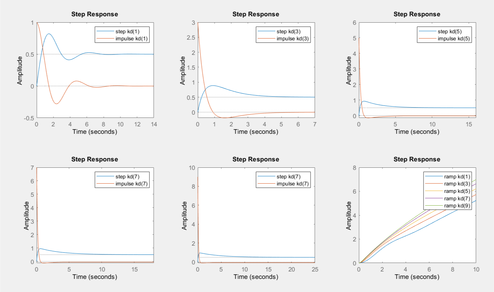

Mendeklarasikan variable yang akan digunakan 

    s = tf('s')
    T = 1
    Kp = 1;
    Kd = 1;
    num = 1;
    den = [T T/16 1];
    sys = tf(num,den);

Kemudian membuat fungsi sistem kontrol berdasarkan KP dan KD yanng telah ditentukan

    sys1 = tf([Kd Kp],[1])
    sys2 = tf([3 Kp],[1])
    sys3 = tf([5 Kp],[1])
    sys4 = tf([7 Kp],[1])
    sys5 = tf([9 Kp],[1])

Setelah fungsi sistem kontrol didapatkan, maka langkah selanjutnya yaitu mengalikan nilai plant dengan fungsi kontrol sesuai nilai KP dan KD nya untuk mendapatkan nilai feedback dari sistem kendali tersebut. 

    final  = feedback(sys*sys1,1)
    final1 = feedback(sys*sys2,1)
    final2 = feedback(sys*sys3,1)
    final3 = feedback(sys*sys4,1)
    final4 = feedback(sys*sys5,1)

Untuk melihat respon dari fungsi feedback tersebut dapat membuat grafik agar dapat dibandingkan analisis responnya.

    figure
    subplot(231), step(final,final*s); 
    legend('step kd(1)','impulse kd(1)')
    subplot(232), step(final1,final1*s);
    legend('step kd(3)','impulse kd(3)')
    subplot(233), step(final2,final2*s);
    legend('step kd(5)','impulse kd(5)')
    subplot(234), step(final3,final3*s);
    legend('step kd(7)','impulse kd(7)')
    subplot(235), step(final4,final4*s);  
    legend('step kd(7)','impulse kd(7)')subplot(236), step(final/s,final1/s,final2/s,final3/s,final4/s,t); 
    legend('ramp kd(1)','ramp kd(3)','ramp kd(5)','ramp kd(7)','ramp kd(9)')

Untuk mengetahui nilai risetime, overshoot, settling time dan juga steady state error dapat menggunakan fungsi dibawah ini:

    subj = final1
    
    fprintf('step\n')
    Risetime = stepinfo(subj).RiseTime
    SettlingTime = stepinfo(subj).SettlingTime
    Overshoot = stepinfo(subj).Overshoot
    
    fprintf('impulse\n')
    Risetime = stepinfo(subj*s).RiseTime
    SettlingTime = stepinfo(subj*s).SettlingTime
    Overshoot = stepinfo(subj*s).Overshoot
    
    fprintf('ramp\n')
    Risetime = stepinfo(subj/s).RiseTime
    SettlingTime = stepinfo(subj/s).SettlingTime
    Overshoot = stepinfo(subj/s).Overshoot
    
    [y,u] = step(final);
    SS = abs(1-y(end))
    
    [y1,u1] = step(final1);
    SS1 = abs(1-y1(end))
    
    [y2,u2] = step(final2);
    SS2 = abs(1-y2(end))
    
    [y3,u3] = step(final3);
    SS3 = abs(1-y3(end))
    
    [y4,u4] = step(final4);
    SS4 = abs(1-y4(end))

Fungsi feedback yang dihasilkan seperti berikut 
1. Nilai KP =1  dan KD = 1

.png)

2. Nilai KP =1  dan KD = 3

.png)

3. Nilai KP =1  dan KD = 5

.png)

4. Nilai KP =1  dan KD = 7

.png)

5. Nilai KP =1  dan KD = 9

.png)

Grafik dari respon sistem 

Perbandingan nilai Risetime, Settlingtime, overshoot, dan juga steady state error
